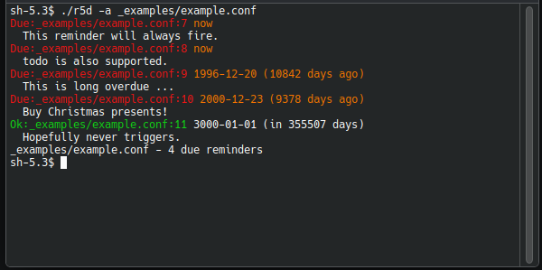

# r5d (remind)

Customizable reminders in configuration (and other) files.



`r5d` will search for `!remind` or `!todo` statements in configuration files and
show a reminder when a defined time has passed.
This utility allows to add notification and alarm clocks directly into
configuration and other text files.

When at least one reminder is due, the program will report it and exit with 
the error code `5`.

## Example

See the following snippet or [example.conf](_examples/example.conf) for a more
detailed example file.

```ini
[server]
# !todo 2025-08-31 Switch to port 9001 (contact support)
address = "localhost:8901"
# !remind now Change the owner now!
owner = "phoenix"

## !noremind Tell r5d to ignore next reminders

[storage]
# !todo This will never trigger
dir = /var/lib/r5d
```

## Description

`!remind` (or `!todo`) statements look like the following:

```
!remind - Reminders flagged with '-' will always fire
# !remind 3000-01-01T00:00:00 Reminders can be in comments

!todo - Is an alias to !remind and works exactly the same way
!todo 2024-12-23 Buy christmas present

!noremind Stop processing reminders.
!remind - This one will not be seen anymore.
```

Reminders can start anywhere in a line. This allows the program to work against
various configuration files, where reminders might be put as comments.
